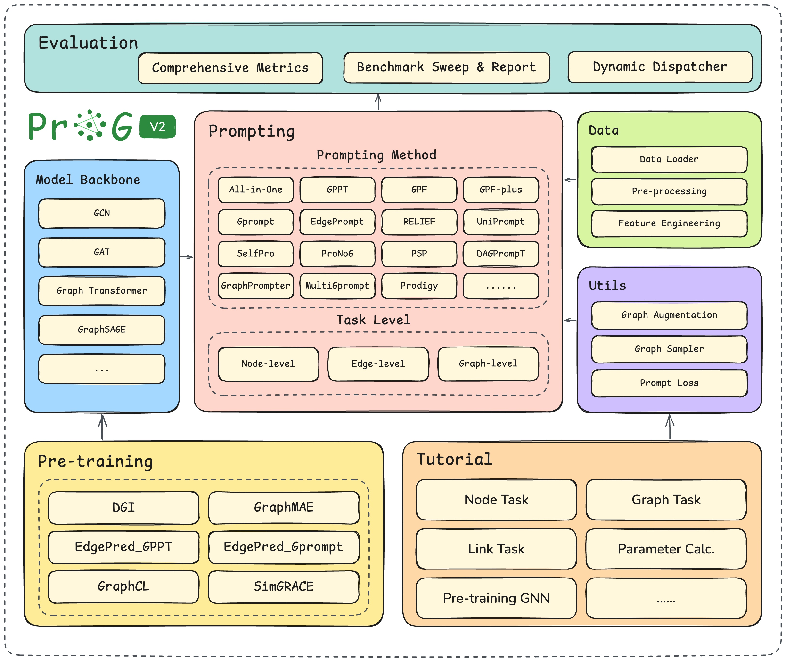

# ProG-V2: A Reproducible Graph Prompt Learning Benchmark

<p align="center">
  
</p>

ProG-V2 is an engineering-focused extension of the original
[ProG benchmark](https://github.com/sheldonresearch/ProG) for graph prompt
learning. It keeps the standard **pre-train → prompt-tune → evaluate** workflow,
while adding a modular prompt-strategy architecture, broader prompt coverage,
centralized path/device/logging utilities, benchmark scripts, tests, and public
merged result reports.

## What's New in ProG-V2

- **17 prompt strategies** registered through a `PromptStrategy` registry.
- **6 GNN backbones** registered through `prompt_graph.model.build_gnn`.
- Reproducible few-shot benchmark utilities for node- and graph-level tasks.
- Centralized filesystem paths, device resolution, logging, and CLI/YAML config.
- Tests for data loading, GNN factory construction, strategy registration, and
  prompt-task smoke runs.
- Fixes for several benchmark-blocking edge cases in WebKB, MultiGprompt,
  RELIEF, and GraphMAE.

## Architecture

<p align="center">
  
</p>

## Benchmark Results

We publish two complementary public GCN benchmark reports: a **node- and
graph-classification** report, and an **edge-task (link-prediction)** report.
Both follow the same `{pretrain}+{prompt}` matrix format so they can be read and
merged with the same tooling.

### Node & Graph Classification

The classification report lives under
[`results/benchmark-gcn/`](./results/benchmark-gcn/) and contains **714
independent `(dataset, shot, pretrain+prompt)` combinations** and **2142 metric
values** over Accuracy, Macro-F1, and AUROC.

Experiment parameters:

| Setting | Value |
|---|---|
| Backbone | GCN |
| GNN layers | 2 |
| Hidden dimension | 128 |
| Seed | 42 |
| Shots | 1-shot, 3-shot, 5-shot |
| Few-shot splits | 5 splits per shot setting (`mean±std`) |
| Downstream budget | 50 epochs with early stopping |
| Pretrain budget | 200 epochs for generated checkpoints |
| Metrics | Accuracy, Macro-F1, AUROC |
| Result format | `{pretrain}+{prompt}` columns |

Coverage:

| Dataset | Task | 1-shot | 3-shot | 5-shot |
|---|---|---:|---:|---:|
| Cora | Node | 72 | 72 | 72 |
| Wisconsin | Node | 59 | 59 | 59 |
| MUTAG | Graph | 56 | 56 | 56 |
| PROTEINS | Graph | 51 | 51 | 51 |

Result files:

- [`summary.csv`](./results/benchmark-gcn/summary.csv): flat table,
  one row per experiment combination.
- [`final_matrices.xlsx`](./results/benchmark-gcn/final_matrices.xlsx):
  12 sheets, one per `(dataset, shot)` task view.
- [`README.md`](./results/benchmark-gcn/README.md): detailed result
  documentation and metric definitions.

### Edge Task (Link Prediction)

The original ProG/All-in-one work also covers an **edge-level task**. In ProG-V2
this is the `LinkTask` downstream task: candidate node pairs are scored, trained
with binary labels, and evaluated mainly by **AUROC** and **AUPRC**. Most prompt
strategies use a dot-product edge decoder; `All-in-one` follows its paper
formulation and reformulates each candidate edge `(u, v)` into an edge-induced
subgraph that is classified by the edge label (see
[`prompt_graph/tasker/all_in_one_link_adapter.py`](./prompt_graph/tasker/all_in_one_link_adapter.py)).

The link-prediction report lives under
[`results/link-prediction-gcn/`](./results/link-prediction-gcn/) and contains
**2912 `(dataset, shot, pretrain+prompt)` combinations** over Accuracy, F1,
AUROC, and AUPRC.

| Setting | Value |
|---|---|
| Backbone | GCN |
| Datasets | CiteSeer, Cora, IMDB-BINARY, MUTAG, PROTEINS, PTC_MR, PubMed, Wisconsin (8) |
| Shots | 0-shot, 1-shot, 3-shot, 5-shot |
| Pretrains | None, DGI, GraphMAE, Edgepred_GPPT, Edgepred_Gprompt, GraphCL, SimGRACE (7) |
| Prompts | 13 LinkTask-supported strategies (including `All-in-one`) |
| Combos per dataset | 91 (13 prompts × 7 pretrains) × 4 shots = 364 cells |
| Primary metrics | AUROC, AUPRC (Accuracy/F1 kept for matrix compatibility) |

Result files:

- [`summary.csv`](./results/link-prediction-gcn/summary.csv): flat table,
  one row per experiment combination.
- [`final_matrices.xlsx`](./results/link-prediction-gcn/final_matrices.xlsx):
  32 sheets, one per `(dataset, shot)` view (4 shots × 8 datasets).
- [`README.md`](./results/link-prediction-gcn/README.md): detailed result
  documentation and metric definitions.

Both reports currently use **GCN**. Other backbones are available in the model
registry but are not part of these public benchmark tables.

## Installation

Use Python 3.9 or 3.11. Python 3.11 is recommended for local development.

```bash
conda create -n prog-v2 python=3.11 -y
conda activate prog-v2
pip install -e ".[dev]"
pre-commit install
```

If PyTorch Geometric extension wheels are not resolved automatically, install the
matching wheels for your PyTorch/CUDA version from the official PyG wheel index:

```bash
python -m pip install torch_scatter torch_sparse -f https://data.pyg.org/whl/
```

## Quick Start

Run a minimal downstream task:

```bash
python downstream_task.py \
  --downstream_task NodeTask \
  --dataset_name Cora \
  --gnn_type GCN \
  --prompt_type GPF \
  --shot_num 1 \
  --epochs 1 \
  --device cpu
```

Run a small benchmark cell and write an Excel matrix:

```bash
python scripts/bootstrap_excel_full.py --gnn_type GCN
python bench.py \
  --pretrain_task NodeTask \
  --dataset_name Cora \
  --prompt_type None \
  --gnn_type GCN \
  --shot_num 1 \
  --epochs 1 \
  --device cpu \
  --pre_train_model_path None \
  --num_iter 1
```

Run a LinkTask cell (link prediction, dot-product decoder):

```bash
# shot_num=0 → RandomLinkSplit baseline; shot_num>0 → k-positive few-shot.
# Datasets in NODE_TASKS use single-graph LP; GRAPH_TASKS use multi-graph LP
# with per-graph negative sampling. See prompt_graph/defines.py::LINK_TASKS
# for the curated dataset list and
# prompt_graph/tasker/link_task.py::LINK_TASK_SUPPORTED_PROMPTS for the
# 13 supported prompt strategies. All-in-one uses an edge-induced-graph
# adapter; GPPT, MultiGprompt, Prodigy, and RELIEF are not yet adapted and
# raise NotImplementedError at construction.
python bench.py \
  --pretrain_task LinkTask \
  --dataset_name Cora \
  --prompt_type GPF \
  --gnn_type GCN \
  --shot_num 0 \
  --epochs 10 \
  --device cpu \
  --pre_train_model_path None \
  --num_iter 1
```

For a single-run LinkTask entry point, `downstream_task.py` also accepts
`--downstream_task LinkTask`:

```bash
python downstream_task.py \
  --downstream_task LinkTask \
  --dataset_name Cora \
  --prompt_type None \
  --gnn_type GCN \
  --shot_num 0 \
  --epochs 2 \
  --device cpu \
  --pre_train_model_path None
```

Recommended LinkTask experiment slices:

| Experiment | Command |
|---|---|
| Main LP extension table | `bash scripts/bench_paper_grid.sh --task link --gnn_type GCN --shots "0 1 3 5"` |
| Publishable subset | `bash scripts/bench_paper_grid.sh --task link --gnn_type GCN --shots "0 1 3 5" --datasets "Cora CiteSeer PubMed Computers Texas Wisconsin MUTAG PROTEINS IMDB-BINARY"` |
| Edge-pretraining ablation | `bash scripts/bench_paper_grid.sh --task link --gnn_type GCN --shots "0" --prompts "None" --pretrains "None DGI GraphMAE Edgepred_GPPT Edgepred_Gprompt GraphCL SimGRACE"` |
| Prompt-family ablation | `bash scripts/bench_paper_grid.sh --task link --gnn_type GCN --shots "0" --pretrains "None" --prompts "None All-in-one GPF GPF-plus EdgePrompt EdgePromptplus UniPrompt Gprompt SelfPro ProNoG PSP DAGPrompT GraphPrompter"` |

For LinkTask, AUROC and AUPRC are the primary metrics. Accuracy and F1 are kept
for matrix compatibility with the classification tasks.

To export LinkTask matrices in the same shape as the public
`final_matrices.xlsx` report:

```bash
python scripts/export_final_matrices.py \
  --input-root Experiment/ExcelResults \
  --output-root results/link-prediction-gcn \
  --task Link \
  --gnn_type GCN
```

For a tested tutorial entry point, see
[`Tutorial/quickstart_progv2.py`](./Tutorial/quickstart_progv2.py).

## Supported Components

### Backbones

- `GCN`
- `GAT`
- `GIN`
- `GraphSAGE`
- `GCov`
- `GraphTransformer`

### Pretraining Methods

- `DGI`
- `GraphMAE`
- `GraphCL`
- `SimGRACE`
- `Edgepred_GPPT`
- `Edgepred_Gprompt`
- `MultiGprompt`

### Prompt Strategies

`None`, `GPF`, `GPF-plus`, `Gprompt`, `All-in-one`, `GPPT`, `Prodigy`,
`GraphPrompter`, `EdgePrompt`, `EdgePromptplus`, `RELIEF`, `MultiGprompt`,
`UniPrompt`, `SelfPro`, `ProNoG`, `PSP`, and `DAGPrompT`.

### Downstream Tasks

| Task | Class | Datasets | Notes |
|---|---|---|---|
| `NodeTask` | `prompt_graph.tasker.NodeTask` | `NODE_TASKS` (12) | Node classification, supports all 17 prompts. |
| `GraphTask` | `prompt_graph.tasker.GraphTask` | `GRAPH_TASKS` (11) | Graph classification, supports all 17 prompts. |
| `LinkTask` | `prompt_graph.tasker.LinkTask` | `LINK_TASKS` (16 curated) | Link prediction with binary BCE + dot-product decoder for most prompts. `All-in-one` uses a separate edge-induced-graph adapter; `GPPT`, `MultiGprompt`, `Prodigy`, and `RELIEF` raise `NotImplementedError` until their LP adapters land. |

## Scripts

The public sweep scripts are parameterized by `--gnn_type`:

```bash
bash scripts/pretrain_full_grid.sh --gnn_type GCN --fast
bash scripts/bench_full_grid.sh --gnn_type GCN --fast --datasets "Cora MUTAG"
```

Useful scripts:

| Script | Purpose |
|---|---|
| `scripts/bootstrap_excel_full.py` | Create empty Excel matrices for a selected backbone. |
| `scripts/pretrain_full_grid.sh` | Pretrain selected methods/datasets/backbone. |
| `scripts/bench_full_grid.sh` | Run the full project benchmark grid with filters. |
| `scripts/pretrain_paper_grid.sh` | Run the paper-scope pretraining grid. |
| `scripts/bench_paper_grid.sh` | Run the paper-scope benchmark grid (Node/Graph classification and the LinkTask edge task). |
| `scripts/merge_result_excels.py` | Merge per-run Excel outputs into one report. |
| `scripts/export_final_matrices.py` | Export populated per-dataset matrices into `summary.csv` and `final_matrices.xlsx`. |

## Development Checks

```bash
ruff check .
ruff format --check .
pytest tests/ -v
```

For contribution guidelines, see [`CONTRIBUTING.md`](./CONTRIBUTING.md).

## Citation

If you find this project useful, please cite the original ProG/graph prompt work:

```bibtex
@article{zi2024prog,
  title={ProG: A Graph Prompt Learning Benchmark},
  author={Chenyi Zi and Haihong Zhao and Xiangguo Sun and Yiqing Lin and Hong Cheng and Jia Li},
  year={2024},
  journal={Advances in Neural Information Processing Systems}
}

@inproceedings{sun2023all,
  title={All in One: Multi-Task Prompting for Graph Neural Networks},
  author={Sun, Xiangguo and Cheng, Hong and Li, Jia and Liu, Bo and Guan, Jihong},
  booktitle={Proceedings of the 29th ACM SIGKDD Conference on Knowledge Discovery and Data Mining},
  year={2023}
}
```
